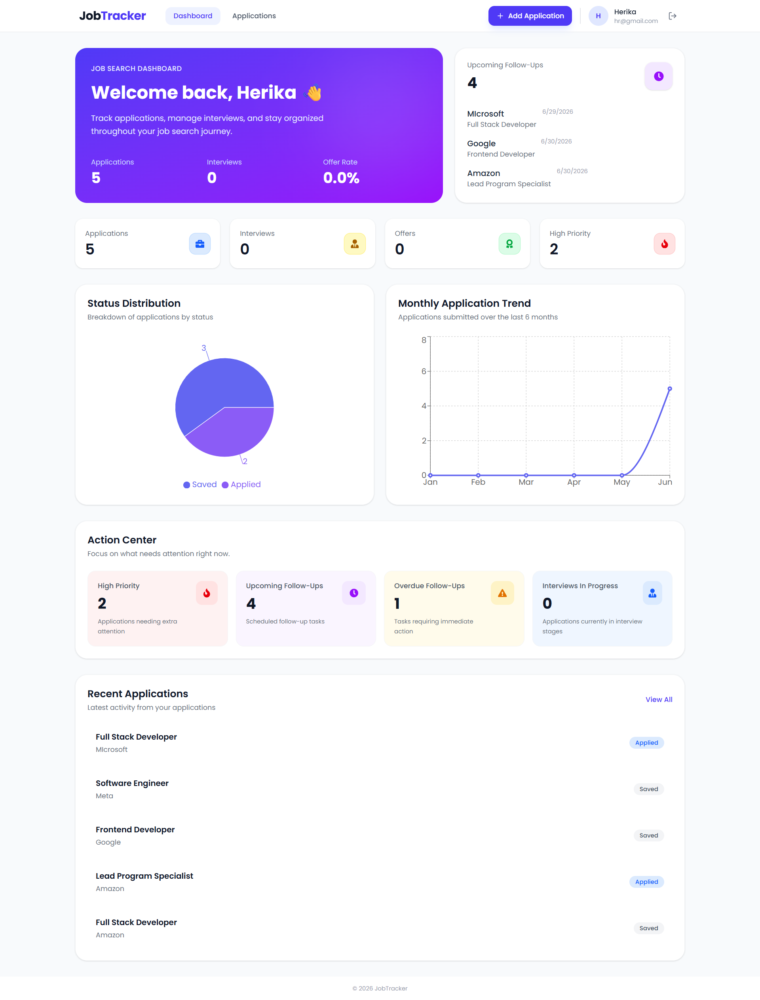
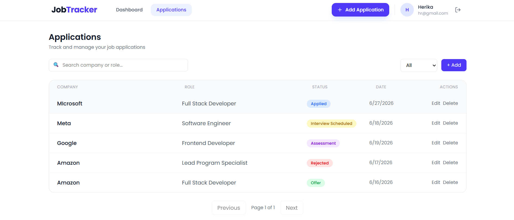
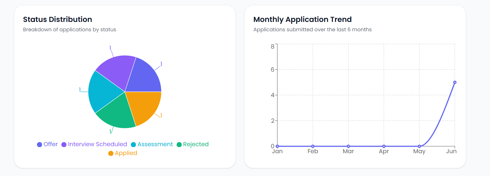
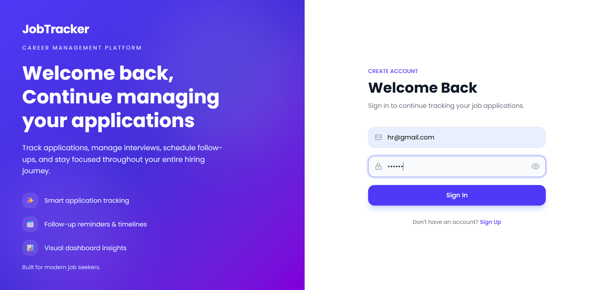
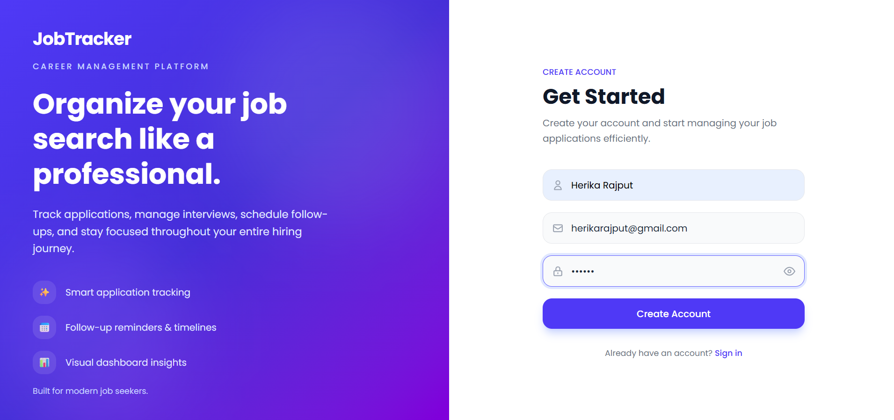
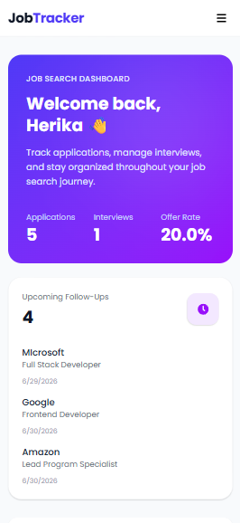
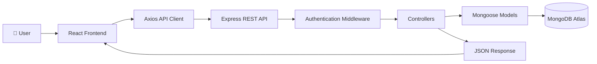
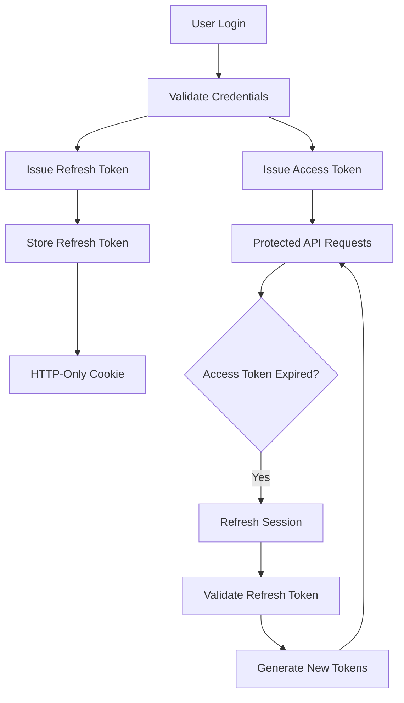
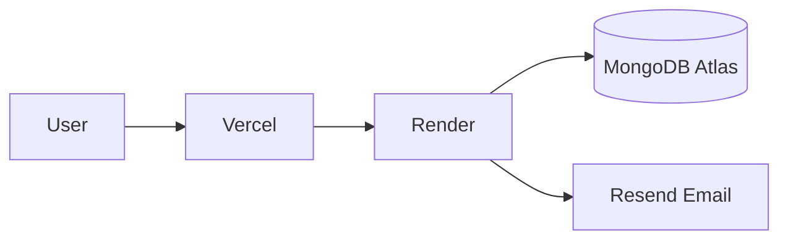

# 🚀 Job Application Tracker

<div align="center">

### Track. Analyze. Optimize. Land Your Next Opportunity.

*A production-ready full-stack job application tracking platform built with **React**, **Express.js**, and **MongoDB** that helps job seekers organize applications, monitor interview progress, and gain actionable insights through an interactive analytics dashboard.*

<br>

[]()
[]()
[]()
[]()
[]()
[]()
[]()

<p>

<a href="#"><strong>🌐 Live Demo</strong></a> • <a href="#"><strong>📖 API</strong></a> • <a href="#"><strong>🐛 Report Bug</strong></a> • <a href="#"><strong>✨ Request Feature</strong></a>

</p>

</div>

---

# 📸 Application Preview

> Replace the placeholders below with your screenshots.

## 🏠 Dashboard

<p align="center">

</p>

---

## 📋 Applications

<p align="center">

</p>

---

## 📊 Analytics

<p align="center">

</p>

---

## 🔐 Authentication

| Login                        | Register                        |
| ---------------------------- | ------------------------------- |
|  |  |

---

## 📱 Responsive Design

<p align="center">

</p>

---

# 🌐 Live Demo

| Service     | URL                |
| ----------- | ------------------ |
| Frontend    | **https://job-application-tacker-theta.vercel.app/** |
| Backend API | **https://job-application-tacker-api.onrender.com/** |

---

# 📖 About

Searching for a job often means managing dozens of applications across multiple platforms. Keeping track of interviews, follow-ups, offers, and application status quickly becomes difficult using spreadsheets or notes.

**Job Application Tracker** provides a centralized platform for managing the entire job search process while offering real-time analytics to help users understand their progress.

Beyond solving a real-world problem, this project was built to demonstrate modern full-stack engineering practices including secure authentication, scalable backend architecture, database optimization, automated testing, and production-ready deployment.

---

# ✨ Features

## 🎯 Product Features

* 🔐 Secure user registration and login
* 📧 Email verification
* 📋 Complete CRUD for job applications
* 🔍 Search applications by company or role
* 🎛 Filter applications by status
* 📄 Server-side pagination
* 📊 Interactive analytics dashboard
* 📈 Monthly application trends
* 📌 Status distribution charts
* 📅 Follow-up tracking
* ⚡ High-priority application management
* 📱 Fully responsive interface

---

## 🏗️ Engineering Highlights

This project focuses on production-style engineering practices rather than only implementing CRUD functionality.

### Authentication & Security

* JWT Access & Refresh Token Architecture
* Refresh Token Rotation
* Refresh Token Reuse Detection
* HTTP-Only Secure Cookies
* Password Hashing (bcrypt)
* Protected Routes
* Rate Limiting

### Backend Engineering

* RESTful API Design
* Modular MVC Architecture
* Centralized Error Handling
* Async Error Wrapper
* Ownership-Based Authorization
* Environment-Based Configuration

### Database

* MongoDB Atlas
* Mongoose ODM
* Aggregation Pipelines
* Compound Indexes
* Optimized Pagination
* Advanced Search & Filtering

### Analytics

* Monthly Trend Analysis
* Status Distribution
* Offer & Interview Rate Calculation
* Follow-up Statistics
* Dashboard Insights

### Quality

* Backend Integration Testing
* Frontend Component Testing
* GitHub Actions CI
* Production Deployment Ready

---

# ⭐ Why This Project?

Many portfolio projects stop after implementing CRUD operations.

This project goes further by showcasing how a modern full-stack application is engineered—from secure authentication and database optimization to automated testing, analytics, and continuous integration.

The goal wasn't simply to build a job tracker, but to build one using patterns and practices commonly found in production applications.

---

# 🏗️ System Architecture

The application follows a modular full-stack architecture that separates the frontend, backend, and database into independent layers. This separation of concerns improves maintainability, scalability, and testability while allowing each layer to evolve independently.



### Architecture Highlights

* Modular React frontend using reusable components
* RESTful Express.js backend
* JWT-based authentication middleware
* MongoDB Atlas for persistent storage
* Clear separation between presentation, business logic, and data access
* Centralized error handling and middleware-based request processing

---

# 🔐 Authentication & Session Management

Authentication is implemented using a **short-lived Access Token** and a **long-lived Refresh Token** to provide a secure and seamless user experience.

Unlike traditional JWT implementations that store tokens in `localStorage`, Refresh Tokens are stored inside **HTTP-Only cookies**, reducing exposure to XSS attacks and enabling secure session renewal.

## Authentication Flow



### Security Features

* JWT Access & Refresh Token Architecture
* Refresh Token Rotation
* Refresh Token Reuse Detection
* HTTP-Only Secure Cookies
* Password Hashing with bcrypt
* Email Verification
* Protected Routes
* Ownership-Based Authorization
* Rate Limiting

This authentication strategy closely mirrors the session management approach used in many modern production web applications.

---

# ⚙️ Tech Stack

| Category              | Technologies                                                    |
| --------------------- | --------------------------------------------------------------- |
| **Frontend**          | React 19, Vite, React Router DOM, Tailwind CSS, Axios, Recharts |
| **Backend**           | Node.js, Express.js                                             |
| **Database**          | MongoDB Atlas, Mongoose                                         |
| **Authentication**    | JWT, HTTP-Only Cookies, bcrypt                                  |
| **Email**             | Resend                                                          |
| **Testing**           | Jest, Supertest, Vitest, React Testing Library                  |
| **CI/CD**             | GitHub Actions                                                  |
| **Deployment**        | Vercel, Render                                                  |
| **Development Tools** | ESLint, Nodemon, Git, GitHub                                    |

---

# 📂 Project Structure

```text
Job-Application-Tracker
│
├── client/
│   ├── src/
│   │   ├── assets/
│   │   ├── components/
│   │   ├── context/
│   │   ├── layouts/
│   │   ├── pages/
│   │   ├── service/
│   │   └── test/
│   └── package.json
│
├── server/
│   ├── controllers/
│   ├── middleware/
│   ├── models/
│   ├── routes/
│   ├── tests/
│   ├── utils/
│   └── package.json
│
└── README.md
```

The project follows a modular folder structure where each directory has a single responsibility. This organization improves maintainability, encourages code reuse, and makes the application easier to scale as new features are introduced.

---

# 🎯 Engineering Decisions

Several design decisions were made to improve the reliability and maintainability of the application.

| Decision                         | Benefit                               |
| -------------------------------- | ------------------------------------- |
| JWT + Refresh Token Architecture | Secure and seamless authentication    |
| HTTP-Only Cookies                | Better protection against XSS attacks |
| MongoDB Aggregation Pipelines    | Efficient analytics generation        |
| Compound Database Indexes        | Faster filtering and querying         |
| Server-Side Pagination           | Improved scalability                  |
| Modular Architecture             | Easier maintenance and extensibility  |
| Centralized Error Handling       | Consistent API responses              |
| GitHub Actions CI                | Automated quality checks              |

---

# 🚀 Getting Started

Follow the steps below to set up the project locally.

## 📋 Prerequisites

Before you begin, make sure you have the following installed:

* Node.js (v20 or later)
* npm
* Git
* MongoDB Atlas account
* Resend account (for email verification)

---

## 📥 Clone the Repository

```bash
git clone https://github.com/your-username/job-application-tracker.git

cd job-application-tracker
```

---

## 📦 Install Dependencies

### Backend

```bash
cd server
npm install
```

### Frontend

```bash
cd client
npm install
```

---

## 🔑 Environment Variables

Create a `.env` file inside the **server** directory.

```env
PORT=5000
NODE_ENV=development

MONGO_URI=your_mongodb_connection_string

JWT_ACCESS_SECRET=your_access_secret
JWT_REFRESH_SECRET=your_refresh_secret

JWT_ACCESS_EXPIRES_IN=15m
JWT_REFRESH_EXPIRES_IN=7d

CLIENT_URL=http://localhost:5173

RESEND_API_KEY=your_resend_api_key
```
> **Note:** This example is intended for local development.
> When deploying the application (e.g., on Render), update the environment variables accordingly, such as setting `NODE_ENV=production` and configuring the production `CLIENT_URL`.

---

## ▶️ Run the Application

### Start Backend

```bash
cd server
npm run dev
```

Backend:

```
http://localhost:5000
```

---

### Start Frontend

```bash
cd client
npm run dev
```

Frontend:

```
http://localhost:5173
```

Open your browser and start tracking your job applications.

---

# 🧪 Testing

The project includes automated tests for both the frontend and backend to ensure core functionality remains reliable.

| Area                      | Tools                          |
| ------------------------- | ------------------------------ |
| Backend Integration Tests | Jest + Supertest               |
| Frontend Component Tests  | Vitest + React Testing Library |

Run backend tests:

```bash
cd server
npm test
```

Run frontend tests:

```bash
cd client
npm test
```

---

# 🔄 Continuous Integration

GitHub Actions automatically validates every code change before deployment.

### Backend Pipeline

* Install dependencies
* Run integration tests
* Verify build

### Frontend Pipeline

* Install dependencies
* Run component tests
* Verify production build

This helps catch issues early and keeps the project deployment-ready.

---

# ☁️ Deployment

The application is deployed using a modern cloud architecture.



| Service       | Platform       |
| ------------- | -------------- |
| Frontend      | Vercel         |
| Backend       | Render         |
| Database      | MongoDB Atlas  |
| Email Service | Resend         |
| CI/CD         | GitHub Actions |

---

# 📈 Future Improvements

Planned enhancements for future versions include:

* OAuth Authentication (Google & GitHub)
* Forgot Password & Password Reset
* Resume Uploads
* Kanban Board
* Calendar Integration
* Email Follow-up Reminders
* Docker Support
* Redis Caching
* Swagger API Documentation
* End-to-End Testing with Playwright

---

# 🤝 Contributing

Contributions are always welcome.

1. Fork the repository.
2. Create a new branch.

```bash
git checkout -b feature/your-feature
```

3. Commit your changes.

```bash
git commit -m "Add new feature"
```

4. Push the branch.

```bash
git push origin feature/your-feature
```

5. Open a Pull Request.

---

# 📄 License

This project is licensed under the **MIT License**.

See the `LICENSE` file for more information.

---

## 👨‍💻 Author

### Herika Rajput

Aspiring Full Stack Developer passionate about building secure, scalable, and production-ready web applications.

> Open to internship and entry-level Full Stack Developer opportunities.

### Connect with Me

- 💼 **LinkedIn:** [Herika Rajput](https://www.linkedin.com/in/herika-rajput)
- 🐙 **GitHub:** [@herikarajput3](https://github.com/herikarajput3)
- 📧 **Email:** herikarajput03@gmail.com
<!-- * 🌐 Portfolio — *Add your portfolio link* -->

---

<div align="center">

### ⭐ If you found this project helpful, consider giving it a star!

Thank you for taking the time to explore this repository.

</div>
