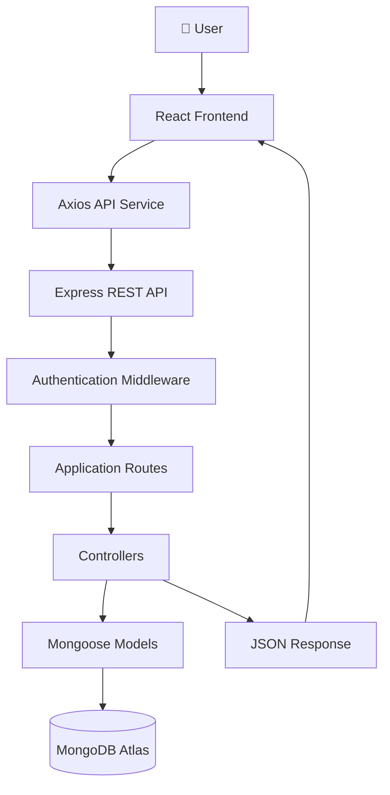
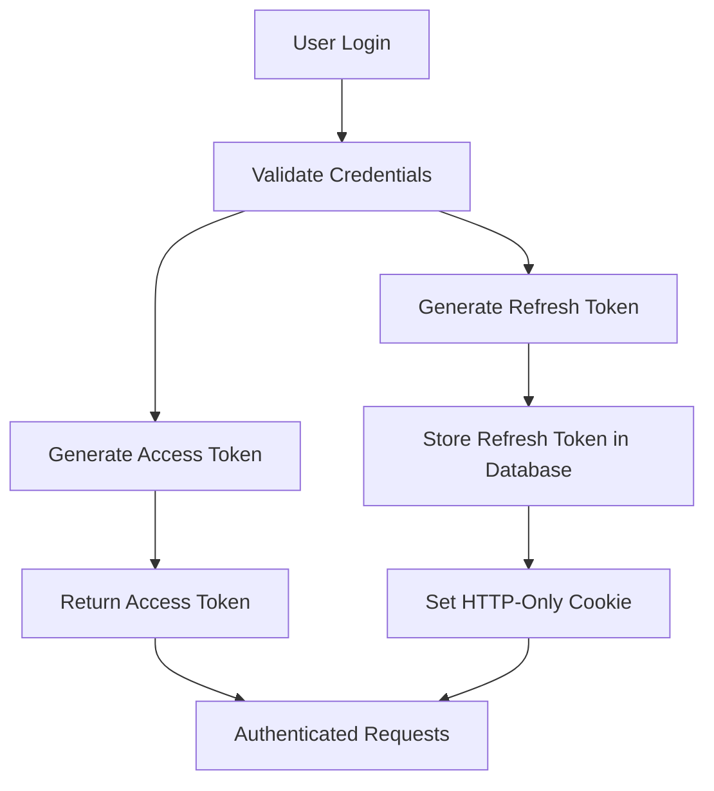
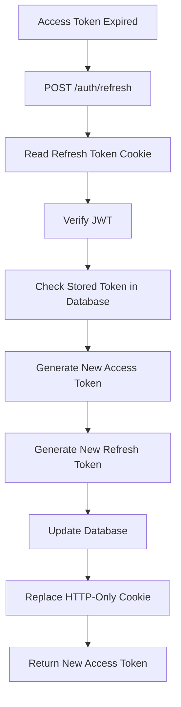
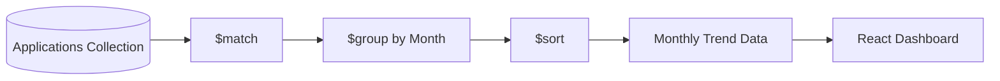
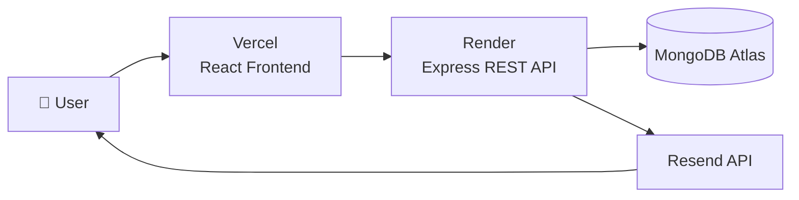

# 🚀 Job Application Tracker

<div align="center">

### Track. Analyze. Optimize. Land Your Next Opportunity.

*A production-ready full-stack job application tracking platform built with **React**, **Express.js**, and **MongoDB**, featuring secure JWT authentication, refresh token rotation, email verification, interactive analytics dashboards, automated testing, and CI/CD pipelines.*

<br>

[]()
[]()
[]()
[]()
[]()
[]()
[]()
[]()

</div>

---

## 📸 Application Preview

> **Replace the image below with your Dashboard screenshot.**
>
> Use your **best-looking desktop dashboard** showing:
>
> * Statistics Cards
> * Monthly Trend Chart
> * Status Distribution Chart
> * Action Center
> * Modern UI

<p align="center">


</p>

---

## 🔗 Live Demo

| Application    | Link                                             |
| -------------- | ------------------------------------------------ |
| 🌐 Frontend    | **Coming Soon** *(Replace with your Vercel URL)* |
| ⚙️ Backend API | **Coming Soon** *(Replace with your Render URL)* |

---

## ⭐ Highlights

* 🔐 Secure JWT Authentication with Refresh Token Rotation
* 📧 Email Verification using Resend
* 📊 Interactive Analytics Dashboard
* 📈 Monthly Application Trends
* 📋 Complete CRUD for Job Applications
* 🔍 Search, Filter & Pagination
* 🔒 Protected Routes & Role-Based Ownership
* ⚡ MongoDB Aggregation Pipelines
* 🧪 Backend & Frontend Testing
* 🚀 Automated CI/CD with GitHub Actions
* 📱 Fully Responsive User Interface

---

> **Built to demonstrate production-ready full-stack engineering practices rather than just CRUD functionality.**

# 📖 About the Project

Searching for a job is often more challenging than the interview process itself. Candidates typically apply to dozens—or even hundreds—of positions across multiple job portals, making it difficult to keep track of application statuses, interview schedules, follow-up dates, and overall progress.

Most people end up managing everything in spreadsheets or notes, which quickly become difficult to maintain and provide little insight into their job search performance.

**Job Application Tracker** was built to solve this problem by providing a centralized platform where users can organize their entire job search in one place while gaining meaningful insights through interactive analytics.

Beyond solving a real-world problem, this project was designed to demonstrate modern full-stack engineering practices. Instead of focusing solely on CRUD operations, it emphasizes secure authentication, scalable backend architecture, optimized database queries, testing, and production-ready deployment.

The application combines a responsive React frontend with a robust Express.js REST API, MongoDB Atlas for data persistence, and JWT-based authentication with refresh token rotation to deliver a secure and seamless user experience.

---

## 🎯 Project Goals

This project was built with the following objectives:

* Provide a clean and intuitive interface for managing job applications.
* Help users monitor interviews, offers, rejections, and follow-up activities.
* Visualize application progress through interactive analytics.
* Demonstrate secure authentication and session management.
* Showcase production-ready backend architecture and engineering best practices.
* Build a portfolio project that reflects real-world software development standards.

---

## 💡 Why This Project Stands Out

Unlike many portfolio projects that stop at implementing CRUD functionality, this application focuses on the engineering decisions required to build software that is secure, maintainable, and scalable.

Some of the key areas emphasized include:

* Secure JWT Authentication with Refresh Token Rotation
* Email Verification Workflow
* Protected API Routes
* Ownership-Based Data Isolation
* MongoDB Aggregation Pipelines
* Compound Database Indexing
* Query Performance Optimization
* Centralized Error Handling
* Automated Testing
* Continuous Integration (CI)
* Responsive User Experience

The goal was not simply to build another job tracker, but to build one using patterns and practices commonly found in production applications.

# ✨ Features

This application combines a modern user experience with production-ready backend engineering. The features below are grouped into **Product Features** and **Engineering Highlights** to showcase both the end-user functionality and the technical implementation behind it.

---

# 🎯 Product Features

### 👤 User Authentication

* Register with email and password
* Secure login and logout
* Email verification workflow
* Persistent user sessions
* Protected application routes

---

### 📋 Job Application Management

* Create new job applications
* View all applications
* Update existing applications
* Delete applications
* View detailed application information

---

### 🔍 Search & Filtering

* Search applications by company name
* Search applications by job role
* Filter applications by status
* Paginated application listing

---

### 📊 Analytics Dashboard

* Total applications overview
* Interview statistics
* Offer statistics
* High-priority application count
* Upcoming follow-ups
* Overdue follow-ups
* Recent applications
* Offer rate calculation
* Interview rate calculation

---

### 📈 Interactive Data Visualization

* Monthly application trend chart
* Status distribution chart
* Quick action center
* Real-time dashboard statistics

---

### 📱 User Experience

* Responsive design
* Clean dashboard layout
* Fast navigation
* Toast notifications
* Loading skeletons
* Form validation
* Friendly error messages

---

# 🏗️ Engineering Highlights

This project was intentionally designed to demonstrate real-world backend architecture and software engineering practices.

### 🔐 Authentication & Security

* JWT Access Token Authentication
* Refresh Token Rotation
* Refresh Token Reuse Detection
* HTTP-Only Secure Cookies
* Email Verification System
* Password Hashing with bcrypt
* Protected API Endpoints
* Ownership-Based Resource Authorization

---

### ⚙️ Backend Architecture

* RESTful API Design
* Modular Controller-Service Architecture
* Middleware-Based Request Processing
* Centralized Error Handling
* Custom Error Response Classes
* Async Error Wrapper
* Environment-Based Configuration

---

### 🗄️ Database Engineering

* MongoDB Atlas
* Mongoose ODM
* Compound Database Indexes
* Schema Validation
* Aggregation Pipelines
* Query Optimization
* Efficient Pagination
* Advanced Filtering
* Full-text Search using Regular Expressions

---

### 📊 Data Analytics

* Monthly application trends using MongoDB Aggregation
* Status distribution analysis
* Offer rate calculation
* Interview success metrics
* Follow-up tracking
* Dashboard performance statistics

---

### 🛡️ API Protection

* Rate Limiting
* Secure Cookie Configuration
* Authentication Middleware
* Authorization Middleware
* Input Validation
* Production-Safe Error Responses

---

### 🧪 Testing

* Backend Integration Testing
* Frontend Component Testing
* Authentication Tests
* CRUD Endpoint Tests
* API Validation Tests

---

### 🚀 DevOps & Deployment

* GitHub Actions CI
* Backend CI Pipeline
* Frontend CI Pipeline
* Automated Test Execution
* Production Deployment Ready
* MongoDB Atlas Integration
* Environment Variable Management

# ⚙️ Tech Stack

This project is built using a modern full-stack JavaScript ecosystem with a strong focus on scalability, maintainability, security, and developer experience.

| Category               | Technologies                                             |
| ---------------------- | -------------------------------------------------------- |
| **Frontend**           | React 19, Vite, React Router DOM, Tailwind CSS, Axios    |
| **Backend**            | Node.js, Express.js                                      |
| **Database**           | MongoDB Atlas, Mongoose                                  |
| **Authentication**     | JWT (Access & Refresh Tokens), HTTP-Only Cookies, bcrypt |
| **Email Service**      | Resend                                                   |
| **Charts & Analytics** | Recharts                                                 |
| **Testing**            | Jest, Supertest, Vitest, React Testing Library           |
| **CI/CD**              | GitHub Actions                                           |
| **Logging**            | Winston                                                  |
| **Development Tools**  | Nodemon, ESLint                                          |
| **Package Manager**    | npm                                                      |
| **Version Control**    | Git & GitHub                                             |

---

# 🖥️ Frontend

The frontend is built with modern React and focuses on delivering a responsive and intuitive user experience.

| Technology           | Purpose                                                 |
| -------------------- | ------------------------------------------------------- |
| **React 19**         | Building reusable UI components                         |
| **Vite**             | Fast development server and optimized production builds |
| **React Router DOM** | Client-side routing and protected routes                |
| **Tailwind CSS**     | Utility-first responsive styling                        |
| **Axios**            | Communication with the backend REST API                 |
| **Recharts**         | Interactive analytics and dashboard visualizations      |
| **React Hot Toast**  | User-friendly notifications                             |

---

# ⚙️ Backend

The backend follows a modular architecture with separated controllers, routes, middleware, models, and utilities.

| Technology             | Purpose                                 |
| ---------------------- | --------------------------------------- |
| **Node.js**            | JavaScript runtime                      |
| **Express.js**         | REST API framework                      |
| **Mongoose**           | Object Data Modeling (ODM) for MongoDB  |
| **JWT**                | Secure authentication and authorization |
| **bcrypt**             | Password hashing                        |
| **Cookie Parser**      | Managing secure HTTP-only cookies       |
| **Express Rate Limit** | Preventing brute-force attacks          |
| **Morgan**             | HTTP request logging                    |
| **Winston**            | Structured application logging          |

---

# 🗄️ Database

| Technology                | Purpose                           |
| ------------------------- | --------------------------------- |
| **MongoDB Atlas**         | Cloud-hosted NoSQL database       |
| **Mongoose Schemas**      | Data modeling and validation      |
| **Compound Indexes**      | Faster filtering and sorting      |
| **Aggregation Pipelines** | Dashboard analytics and reporting |

---

# 🔐 Authentication & Security

The application implements a production-style authentication flow instead of relying on a single JWT.

### Authentication Features

* JWT Access Tokens
* Refresh Token Rotation
* Refresh Token Reuse Detection
* HTTP-Only Secure Cookies
* Password Hashing with bcrypt
* Email Verification
* Protected Routes
* Ownership-Based Authorization
* Rate Limiting
* Environment Variable Configuration

---

# 🧪 Testing

Testing is implemented for both the frontend and backend to improve reliability and maintainability.

### Backend

* Jest
* Supertest
* MongoDB Memory Server
* API Integration Testing

### Frontend

* Vitest
* React Testing Library
* Component Testing
* Authentication Flow Testing

---

# 🚀 DevOps & Deployment

| Tool               | Purpose                  |
| ------------------ | ------------------------ |
| **GitHub Actions** | Continuous Integration   |
| **Render**         | Backend Deployment       |
| **Vercel**         | Frontend Deployment      |
| **MongoDB Atlas**  | Managed Database Hosting |

---

# 📦 Project Structure

The application follows a modular architecture where each layer has a clearly defined responsibility.

```text
Frontend (React + Vite)
        │
        ▼
Axios API Service
        │
        ▼
REST API (Express.js)
        │
 ┌──────┼────────┐
 │      │        │
 ▼      ▼        ▼
Routes Controllers Middleware
        │
        ▼
Business Logic
        │
        ▼
Mongoose Models
        │
        ▼
MongoDB Atlas
```

# 🏗️ System Architecture

The application follows a layered architecture that separates presentation, routing, business logic, middleware, and data persistence. This separation of concerns makes the codebase easier to maintain, test, and scale as new features are added.

The frontend communicates with the backend through a REST API. Incoming requests pass through middleware for authentication and validation before reaching the appropriate controller. Controllers handle the business logic and interact with MongoDB using Mongoose models.

---

## 🏛 High-Level Architecture



---

## 🔄 Request Lifecycle

Every request follows a predictable lifecycle throughout the application.

```text
User Action
      │
      ▼
React Component
      │
      ▼
Axios API Request
      │
      ▼
Express Route
      │
      ▼
Authentication Middleware
      │
      ▼
Controller
      │
      ▼
Business Logic
      │
      ▼
MongoDB
      │
      ▼
JSON Response
      │
      ▼
React UI Update
```

---

# 🧩 Backend Architecture

The backend follows a modular structure where every layer has a single responsibility.

```text
Client Request
      │
      ▼
Routes
      │
      ▼
Middleware
      │
      ▼
Controllers
      │
      ▼
Models
      │
      ▼
MongoDB
```

### Routes

Routes define the application's API endpoints and connect incoming requests to the appropriate controllers.

**Examples**

* Authentication Routes
* Application Routes
* Dashboard Routes

---

### Middleware

Middleware handles reusable functionality before requests reach the business logic.

Responsibilities include:

* JWT Authentication
* Route Protection
* Rate Limiting
* Error Handling
* Async Error Wrapping

---

### Controllers

Controllers contain the application's business logic.

Examples include:

* User Registration
* Login
* Token Refresh
* Email Verification
* CRUD Operations
* Dashboard Analytics

---

### Models

Mongoose models define the application's data structure, validation rules, relationships, and database indexes.

Current models include:

* User
* Application

---

# 🎨 Frontend Architecture

The frontend follows a component-based architecture with a clear separation between pages, reusable UI components, layouts, services, and global state.

```text
Pages
   │
   ▼
Reusable Components
   │
   ▼
API Service (Axios)
   │
   ▼
Backend REST API
```

### Pages

Responsible for rendering complete application screens.

Examples:

* Login
* Register
* Dashboard
* Applications
* Application Details

---

### Components

Reusable UI building blocks shared across multiple pages.

Examples:

* Application Table
* Application Form
* Navbar
* Stat Cards
* Charts
* Modal
* Footer

---

### Context API

Authentication state is managed globally using React Context, allowing protected routes and authenticated user information to be shared throughout the application.

---

### API Service

A dedicated Axios service centralizes communication with the backend, making API requests easier to manage and maintain.

---

# 🎯 Design Principles

Several architectural principles guided the development of this project.

### Separation of Concerns

Each layer has a single responsibility, reducing coupling and improving maintainability.

---

### Reusability

Frontend components and backend middleware are designed to be reusable across multiple features.

---

### Scalability

The modular folder structure allows new modules, routes, controllers, and features to be added without affecting existing functionality.

---

### Maintainability

Business logic, routing, authentication, and database access are separated into dedicated modules, making the codebase easier to understand and extend.

---

### Security by Design

Authentication, authorization, secure cookies, refresh token rotation, and centralized error handling are integrated into the application's architecture rather than added as afterthoughts.

# 🔐 Authentication & Session Management

Authentication is one of the most security-critical parts of any web application. Rather than relying on a single JWT stored in the browser, this project implements a production-inspired authentication architecture using **Access Tokens**, **Refresh Tokens**, **HTTP-Only Cookies**, and **Email Verification**.

The goal is to provide a secure, scalable, and maintainable authentication flow while reducing common security risks such as token theft and unauthorized session reuse.

---

# 🏛 Authentication Architecture



---

# 🔄 Access Token Flow

Access Tokens are short-lived JWTs used to authenticate API requests.

```text
User Login
      │
      ▼
Access Token Issued
      │
      ▼
Stored in Client Memory
      │
      ▼
Sent in Authorization Header
      │
      ▼
Protected API Routes
```

### Why Access Tokens?

* Short expiration time reduces security risk.
* Used only for authenticated API requests.
* Never stored permanently in the database.
* Easily regenerated using a valid Refresh Token.

---

# 🔄 Refresh Token Flow

Unlike Access Tokens, Refresh Tokens are designed to maintain user sessions securely without requiring frequent logins.



---

# 🔁 Refresh Token Rotation

Every successful refresh request generates **both** a new Access Token and a brand-new Refresh Token.

```text
Old Refresh Token
        │
        ▼
Validated
        │
        ▼
New Access Token
        │
        ▼
New Refresh Token
        │
        ▼
Old Refresh Token Invalidated
```

This approach limits the lifetime of compromised refresh tokens and improves session security.

---

# 🚨 Refresh Token Reuse Detection

The backend stores the latest Refresh Token for each user.

Whenever a refresh request is received:

```text
Incoming Refresh Token
        │
        ▼
Compare with Database
        │
 ┌──────┴──────┐
 │             │
 ▼             ▼
Match      Doesn't Match
 │             │
 ▼             ▼
Issue New   Revoke Session
Tokens       Reject Request
```

If a previously invalidated Refresh Token is reused, the request is rejected and the stored session is invalidated.

This helps detect potential token theft or replay attacks.

---

# 🍪 Secure Cookie Strategy

Refresh Tokens are stored inside **HTTP-Only Cookies** instead of JavaScript-accessible storage.

### Benefits

* Not accessible through JavaScript
* Helps mitigate XSS attacks
* Automatically included with authenticated requests
* Configured with secure cookie options for production environments

---

# 📧 Email Verification

New users receive a verification email during registration.

```text
Register
     │
     ▼
Generate Verification Token
     │
     ▼
Send Email
     │
     ▼
User Clicks Verification Link
     │
     ▼
Backend Validates Token
     │
     ▼
Account Verified
```

Email verification ensures that only valid email addresses can activate user accounts.

---

# 🛡 Route Protection

Protected API endpoints require a valid Access Token.

Every authenticated request follows this process:

```text
Request
     │
     ▼
Authorization Header
     │
     ▼
JWT Verification
     │
     ▼
Find User
     │
     ▼
Attach User to Request
     │
     ▼
Controller Execution
```

Requests with missing, expired, or invalid tokens are rejected before reaching the application's business logic.

---

# 🔒 Security Features

The authentication system incorporates multiple security practices commonly used in production applications.

### Authentication

* JWT Access Tokens
* JWT Refresh Tokens
* Refresh Token Rotation
* Refresh Token Reuse Detection
* Email Verification

---

### Session Management

* HTTP-Only Cookies
* Secure Cookie Configuration
* Automatic Session Renewal
* Logout Session Invalidation

---

### API Protection

* Protected Routes
* Authentication Middleware
* Ownership-Based Authorization
* Rate Limiting
* Password Hashing using bcrypt

---

# 💭 Why This Architecture?

Many beginner projects store JWTs in `localStorage` and use a single long-lived token for authentication.

While simple, that approach exposes tokens to JavaScript and increases the impact of token theft.

This project adopts a more secure architecture by separating authentication into short-lived Access Tokens and long-lived Refresh Tokens stored in HTTP-Only cookies. Combined with refresh token rotation and reuse detection, this approach improves session security while providing a smoother user experience through automatic session renewal.

Although simplified compared to enterprise identity providers, the overall design closely mirrors authentication patterns used in many modern production web applications.

# 📊 Dashboard Analytics & Database Engineering

The dashboard was designed to provide more than a simple overview of stored applications. Instead of displaying raw data, the backend transforms application records into actionable insights using MongoDB Aggregation Pipelines and optimized database queries.

By moving analytical computations to the database layer, the frontend receives ready-to-use data, reducing client-side processing and improving overall application performance.

---

# 📈 Dashboard Overview

The analytics dashboard provides users with a quick snapshot of their job search progress.

### Available Metrics

* Total Applications
* Interview Count
* Offer Count
* Offer Rate
* Interview Rate
* High Priority Applications
* Upcoming Follow-Ups
* Overdue Follow-Ups
* Recent Applications

These metrics help users understand both their current progress and areas that require attention.

---

# 📊 Monthly Application Trends

The application generates a six-month activity timeline using MongoDB Aggregation Pipelines.



### Why this approach?

Instead of fetching every application and grouping them in JavaScript, the database performs the aggregation and returns only the summarized results.

Benefits include:

* Faster response times
* Less network traffic
* Reduced frontend processing
* Better scalability for larger datasets

---

# 📌 Status Distribution Analysis

The dashboard visualizes how applications are distributed across different hiring stages.

Example statuses include:

* Saved
* Applied
* Assessment
* Interview Scheduled
* Interviewed
* Offer
* Rejected
* Ghosted

The backend aggregates these records into a compact dataset that is rendered as an interactive chart on the frontend.

---

# 📈 Performance Metrics

Rather than displaying only counts, the application calculates meaningful performance indicators.

### Offer Rate

```text
Offer Rate =
(Number of Offers / Total Applications) × 100
```

---

### Interview Rate

```text
Interview Rate =
(Number of Interviews / Total Applications) × 100
```

These calculated metrics provide users with a clearer understanding of the effectiveness of their job search.

---

# 📅 Follow-Up Tracking

The dashboard automatically categorizes follow-up tasks into two groups.

### Upcoming Follow-Ups

Applications requiring action in the future.

### Overdue Follow-Ups

Applications whose follow-up dates have already passed.

This allows users to prioritize outreach and avoid missing important opportunities.

---

# ⚡ Database Optimization

The backend was designed with query efficiency in mind.

### Compound Database Indexes

Indexes are created to optimize the most frequently executed queries.

```text
(user, createdAt)
```

Optimizes:

* Recent applications
* Pagination
* Dashboard loading

---

```text
(user, status)
```

Optimizes:

* Status filtering
* Dashboard statistics
* Aggregation queries

---

# 🔍 Efficient Search & Filtering

Users can quickly locate applications by searching across multiple fields.

Supported filters include:

* Company Name
* Job Role
* Application Status
* Pagination

The backend performs filtering directly within MongoDB, ensuring only relevant records are returned.

---

# 📄 Server-Side Pagination

Instead of loading every application at once, the backend returns paginated results.

```text
Applications
        │
        ▼
Apply Filters
        │
        ▼
Count Documents
        │
        ▼
Skip Records
        │
        ▼
Limit Results
        │
        ▼
Return Current Page
```

This approach keeps response sizes small and maintains consistent performance as the dataset grows.

---

# ⚙️ Query Performance

During development, database queries were analyzed using MongoDB's query execution statistics to better understand execution plans and identify potential optimization opportunities.

Execution time measurements were also used to evaluate query performance and validate optimization efforts before returning data to the client.

---

# 🎯 Why Perform Analytics in the Database?

Moving aggregation logic to MongoDB provides several advantages over processing data in the frontend.

### Benefits

* Reduced API response size
* Faster dashboard rendering
* Lower frontend computation
* Better scalability
* Cleaner backend architecture
* Centralized business logic
* Consistent analytical calculations

---

# 💡 Engineering Decisions

Several design decisions were made to improve both performance and maintainability.

* Aggregation Pipelines for analytical queries
* Compound indexes for commonly accessed data
* Server-side pagination
* Backend filtering and searching
* Database-side statistical calculations
* Structured API responses for dashboard components

By handling analytical processing within the database layer, the application remains responsive while keeping the frontend focused solely on presentation.

# 📂 Project Structure

The project follows a modular architecture that separates the frontend and backend into independent applications. Within each application, files are organized by responsibility rather than by feature size, making the codebase easier to understand, maintain, and extend.

```
Job-Application-Tracker
│
├── client/          # React Frontend
│
└── server/          # Express Backend
```

This separation allows the frontend and backend to evolve independently while communicating through a RESTful API.

---

# 🖥️ Frontend Structure

```text
client/
│
├── src/
│   ├── assets/
│   ├── components/
│   │   ├── dashboard/
│   │   ├── ApplicationForm.jsx
│   │   ├── ApplicationTable.jsx
│   │   ├── Modal.jsx
│   │   ├── Navbar.jsx
│   │   ├── ProtectedRoute.jsx
│   │   └── ...
│   │
│   ├── context/
│   │
│   ├── layouts/
│   │
│   ├── pages/
│   │   ├── auth/
│   │   ├── applications/
│   │   └── dashboard/
│   │
│   ├── service/
│   │
│   ├── test/
│   │
│   ├── App.jsx
│   └── main.jsx
│
└── package.json
```

---

## 📁 assets/

Contains static resources used throughout the application.

Examples:

* Images
* Icons
* Branding assets

---

## 🧩 components/

Reusable UI components shared across multiple pages.

Examples include:

* Application Table
* Application Form
* Dashboard Cards
* Charts
* Navbar
* Modal
* Footer

Keeping UI components reusable reduces duplication and simplifies future maintenance.

---

## 📊 components/dashboard/

Contains components dedicated to the analytics dashboard.

Examples:

* Monthly Trend Chart
* Status Distribution Chart
* Dashboard Skeleton
* Action Center

Separating dashboard-specific components keeps analytics logic isolated from the rest of the UI.

---

## 📄 pages/

Each page represents a complete screen within the application.

Current pages include:

### Authentication

* Login
* Register
* Verify Email

### Dashboard

* Dashboard

### Applications

* Applications List
* Application Details

Pages compose reusable components rather than implementing UI directly.

---

## 🌍 context/

Global application state is managed using React Context.

Responsibilities include:

* Authentication State
* Current User
* Session Management

Using Context avoids excessive prop drilling and keeps authentication accessible throughout the application.

---

## 📐 layouts/

Contains shared layout components that provide a consistent structure across multiple pages.

Examples include:

* Navigation
* Shared page wrapper
* Common page layout

---

## 🔌 service/

Contains the centralized Axios API client.

Benefits:

* Single API configuration
* Easier authentication handling
* Cleaner page components
* Reusable HTTP requests

---

## 🧪 test/

Contains frontend testing utilities and setup configuration.

---

# ⚙️ Backend Structure

```text
server/
│
├── controllers/
├── middleware/
├── models/
├── routes/
├── utils/
├── tests/
├── scripts/
├── server.js
└── package.json
```

The backend follows a layered architecture where every directory has a clearly defined responsibility.

---

## 🎮 controllers/

Controllers contain the application's business logic.

Examples include:

* User Authentication
* Job Application Management
* Dashboard Analytics

Controllers receive requests, execute business logic, and return structured responses.

---

## 🛣️ routes/

Routes define the REST API endpoints and map incoming requests to their corresponding controllers.

This keeps routing separate from application logic and improves readability.

---

## 🗄️ models/

Mongoose models define:

* Database schema
* Validation rules
* Relationships
* Database indexes

Keeping schemas centralized ensures consistent validation across the application.

---

## 🛡️ middleware/

Middleware contains reusable request-processing logic.

Responsibilities include:

* Authentication
* Authorization
* Rate Limiting
* Error Handling
* Async Error Wrapping

Because middleware is reusable, the same security logic can be applied across multiple routes without duplication.

---

## 🧰 utils/

Contains helper functions shared throughout the application.

Examples:

* JWT Generation
* Cookie Configuration
* Email Service
* Verification Token Generation
* Custom Error Classes
* Logging Utilities

Separating utilities keeps controllers focused on business logic.

---

## 🧪 tests/

Contains backend integration tests for API endpoints and authentication workflows.

Testing is isolated from production code to maintain a clean project structure.

---

## 📜 scripts/

Utility scripts used during development.

Examples include:

* Database seeding
* Test data generation

---

# 🎯 Design Principles

The folder structure was designed around several engineering principles.

---

## 📦 Modularity

Every directory has a single responsibility.

This minimizes coupling and makes the codebase easier to extend.

---

## ♻️ Reusability

Shared logic is extracted into reusable components, middleware, and utility functions rather than duplicated across the project.

---

## 🧹 Maintainability

Separating business logic, routing, data access, and presentation makes the project easier to debug, test, and modify.

---

## 📈 Scalability

New features can be introduced by adding new routes, controllers, models, pages, and components without affecting existing modules.

---

## 🧪 Testability

Because responsibilities are clearly separated, individual components and API endpoints can be tested in isolation, improving reliability and making future refactoring safer.

---

# 💭 Why This Structure?

As applications grow, keeping all logic in a few large files quickly becomes difficult to maintain.

By organizing the project into focused modules with clear responsibilities, the codebase remains readable, scalable, and easier for multiple developers to work on collaboratively.

This architecture mirrors common practices used in modern production applications, making it easier to onboard new contributors and support future feature development.

# 🚀 Getting Started

Follow the steps below to set up the project locally for development.

---

# 📋 Prerequisites

Before running this project, make sure you have the following installed:

| Software              | Recommended Version |
| --------------------- | ------------------- |
| Node.js               | 20+                 |
| npm                   | Latest              |
| MongoDB Atlas Account | Required            |
| Git                   | Latest              |

You will also need:

* A MongoDB Atlas connection string
* JWT secrets
* A Resend API key (for email verification)

---

# 📥 Clone the Repository

```bash
git clone https://github.com/your-username/job-application-tracker.git

cd job-application-tracker
```

---

# 📦 Install Dependencies

The project consists of two independent applications:

* Frontend (React + Vite)
* Backend (Express.js)

### Install Backend

```bash
cd server

npm install
```

---

### Install Frontend

```bash
cd ../client

npm install
```

---

# 🔑 Environment Variables

Create a `.env` file inside the **server** directory.

```env
# Server
PORT=5000
NODE_ENV=development

# MongoDB
MONGO_URI=your_mongodb_connection_string

# JWT
JWT_ACCESS_SECRET=your_access_secret
JWT_REFRESH_SECRET=your_refresh_secret

JWT_ACCESS_EXPIRES_IN=15m
JWT_REFRESH_EXPIRES_IN=7d

# Client
CLIENT_URL=http://localhost:5173

# Email
RESEND_API_KEY=your_resend_api_key
```

---

# ▶️ Running the Backend

Navigate to the backend directory.

```bash
cd server

npm run dev
```

The backend server will start on:

```text
http://localhost:5000
```

---

# 💻 Running the Frontend

Open another terminal.

```bash
cd client

npm run dev
```

The frontend will start on:

```text
http://localhost:5173
```

---

# 🌐 Running the Complete Application

Start both servers.

```text
Backend
http://localhost:5000

        ⬇

Frontend
http://localhost:5173
```

Open your browser and navigate to:

```text
http://localhost:5173
```

---

# 🧪 Running Tests

## Backend Tests

```bash
cd server

npm test
```

---

## Frontend Tests

```bash
cd client

npm test
```

---

# 📦 Production Build

Generate an optimized production build for the frontend.

```bash
cd client

npm run build
```

Preview the production build locally.

```bash
npm run preview
```

---

# 📜 Available Scripts

## Backend

| Command        | Description                  |
| -------------- | ---------------------------- |
| `npm run dev`  | Start development server     |
| `npm start`    | Start production server      |
| `npm test`     | Run backend tests            |
| `npm run seed` | Seed sample application data |

---

## Frontend

| Command           | Description                   |
| ----------------- | ----------------------------- |
| `npm run dev`     | Start Vite development server |
| `npm run build`   | Create production build       |
| `npm run preview` | Preview production build      |
| `npm test`        | Run frontend tests            |

---

# 📁 Recommended Development Workflow

```text
Clone Repository
        │
        ▼
Install Dependencies
        │
        ▼
Configure Environment Variables
        │
        ▼
Start Backend
        │
        ▼
Start Frontend
        │
        ▼
Register User
        │
        ▼
Verify Email
        │
        ▼
Login
        │
        ▼
Start Tracking Applications
```

---

# ✅ Setup Checklist

Before using the application, ensure the following:

* Node.js is installed
* Dependencies are installed
* MongoDB Atlas is connected
* Environment variables are configured
* Backend server is running
* Frontend server is running
* Resend API key is configured
* Email verification is working

Once everything is configured, the application is ready for local development.

# 🧪 Testing & Quality Assurance

Building reliable software requires more than implementing features—it requires verifying that those features continue to work as the application evolves.

This project includes testing for both the backend and frontend, helping ensure authentication, API endpoints, and user interface components behave as expected while reducing the risk of regressions during future development.

---

# 🎯 Testing Strategy

Testing is divided into two independent layers.

```text
                    Testing Strategy

                 ┌──────────────────┐
                 │    Frontend      │
                 └────────┬─────────┘
                          │
         Component Tests • UI Tests
                          │
──────────────────────────────────────────────────
                          │
                 ┌────────▼─────────┐
                 │     Backend      │
                 └────────┬─────────┘
                          │
      API Tests • Authentication • Integration Tests
```

This separation allows both the client and server to be tested independently while maintaining confidence in the application's overall behavior.

---

# ⚙️ Backend Testing

The backend focuses primarily on **integration testing**, validating how different parts of the application work together rather than testing isolated functions.

### Technologies

* Jest
* Supertest
* MongoDB Memory Server

---

### What is Tested?

#### 🔐 Authentication

* User Registration
* User Login
* Protected Routes
* JWT Authentication
* Refresh Token Flow
* Logout

---

#### 📋 Application API

* Create Application
* Retrieve Applications
* Update Application
* Delete Application
* Fetch Single Application

---

#### ✅ Validation

* Required Fields
* Invalid Input
* Error Responses
* Authentication Failures

---

#### 🛡 Security

* Unauthorized Access
* Invalid Tokens
* Ownership Validation
* Protected Endpoints

---

# 🎨 Frontend Testing

The frontend focuses on verifying that the user interface behaves correctly from the user's perspective.

### Technologies

* Vitest
* React Testing Library

---

### What is Tested?

* Authentication Pages
* User Interactions
* Component Rendering
* Form Behaviour
* UI States

Frontend tests help ensure that components render correctly and continue working as expected after future changes.

---

# 🧪 Why Integration Testing?

Rather than testing individual functions in isolation, integration tests validate complete API workflows.

Example:

```text
Register User
      │
      ▼
Store User
      │
      ▼
Generate JWT
      │
      ▼
Return Response
```

Instead of checking each step independently, the entire request lifecycle is verified.

This approach provides greater confidence that real API requests behave correctly.

---

# 🔄 Continuous Integration

Every code change should be automatically verified before deployment.

This project includes **GitHub Actions** workflows that automate quality checks whenever new code is pushed to the repository.

```text
Developer Pushes Code
          │
          ▼
GitHub Actions
          │
 ┌────────┴────────┐
 │                 │
 ▼                 ▼
Backend CI     Frontend CI
 │                 │
 ▼                 ▼
Run Tests     Run Tests
 │                 │
 └────────┬────────┘
          ▼
     Build Validation
          │
          ▼
     Ready for Deployment
```

Continuous Integration helps identify issues early and ensures that new changes do not unintentionally break existing functionality.

---

# 🚀 Quality Assurance Practices

Several engineering practices were followed throughout development to improve code quality and maintainability.

### Code Organization

* Modular Architecture
* Separation of Concerns
* Reusable Components
* Reusable Middleware

---

### Error Handling

* Centralized Error Middleware
* Consistent API Responses
* Production-Safe Error Messages

---

### Security

* JWT Authentication
* HTTP-Only Cookies
* Password Hashing
* Rate Limiting
* Email Verification

---

### Database

* Schema Validation
* Compound Indexes
* Aggregation Pipelines
* Server-Side Pagination

---

# 📈 Why Testing Matters

As applications grow, adding new features can unintentionally introduce bugs into existing functionality.

Automated testing provides confidence that critical features—such as authentication, CRUD operations, and protected routes—continue to work correctly after future changes.

This makes the project easier to maintain, safer to refactor, and more reliable for long-term development.

---

# 📋 Testing Summary

| Area                   | Coverage |
| ---------------------- | -------- |
| Authentication         | ✅        |
| Protected Routes       | ✅        |
| CRUD Operations        | ✅        |
| API Validation         | ✅        |
| Frontend Components    | ✅        |
| User Interaction       | ✅        |
| Integration Testing    | ✅        |
| Continuous Integration | ✅        |

The testing strategy focuses on verifying the application's most critical workflows, ensuring both functionality and reliability across the frontend and backend.

# ☁️ Deployment & DevOps

The application is designed to be deployment-ready using a modern cloud-based architecture. The frontend, backend, and database are deployed independently, allowing each layer to scale and evolve without impacting the others.

Continuous Integration (CI) is implemented using GitHub Actions to automatically validate code quality before deployment.

---

# 🌍 Production Architecture



---

# 🚀 Deployment Overview

| Layer               | Platform       | Responsibility                         |
| ------------------- | -------------- | -------------------------------------- |
| **Frontend**        | Vercel         | Hosts the React application            |
| **Backend**         | Render         | Hosts the Express.js REST API          |
| **Database**        | MongoDB Atlas  | Stores application data                |
| **Email Service**   | Resend         | Sends email verification links         |
| **Version Control** | GitHub         | Source code management                 |
| **CI Pipeline**     | GitHub Actions | Automated testing and build validation |

---

# 🔄 Deployment Workflow

Every code change follows a consistent deployment workflow.

```text
Developer
     │
     ▼
Push Code to GitHub
     │
     ▼
GitHub Actions
     │
 ┌───┴──────────────┐
 │                  │
 ▼                  ▼
Frontend CI     Backend CI
 │                  │
 ▼                  ▼
Run Tests      Run Tests
 │                  │
 └──────┬───────────┘
        ▼
Build Validation
        │
        ▼
Deploy
        │
 ┌──────┴─────────┐
 │                │
 ▼                ▼
Vercel         Render
 │                │
 └──────┬─────────┘
        ▼
 MongoDB Atlas
```

---

# ⚙️ Continuous Integration

GitHub Actions automatically validates every code change before deployment.

### Frontend Pipeline

The frontend workflow performs:

* Install dependencies
* Build validation
* Frontend test execution
* Dependency verification

---

### Backend Pipeline

The backend workflow performs:

* Install dependencies
* Backend integration tests
* API validation
* Build verification

Automating these checks helps catch issues early and ensures that only validated code reaches production.

---

# 🌐 Environment Configuration

Sensitive configuration values are managed using environment variables rather than being hardcoded into the application.

Examples include:

* MongoDB Connection String
* JWT Secrets
* Resend API Key
* Client URL
* Environment Mode

Keeping secrets outside the codebase improves security and simplifies deployment across different environments.

---

# 🔒 Production Considerations

The application includes several production-oriented practices.

### Security

* HTTP-Only Refresh Token Cookies
* Password Hashing
* JWT Authentication
* Refresh Token Rotation
* Rate Limiting
* Environment-Based Configuration

---

### Reliability

* Centralized Error Handling
* Structured Logging
* Consistent API Responses
* Validation at the Model Layer

---

### Performance

* Compound Database Indexes
* Aggregation Pipelines
* Server-Side Pagination
* Optimized Database Queries

---

# 📈 Scalability

The deployment architecture separates each layer of the application.

```text
Frontend
    │
    ▼
Backend API
    │
    ▼
Database
```

This separation provides several advantages:

* Independent deployments
* Easier maintenance
* Better scalability
* Simplified debugging
* Clear separation of responsibilities

As the application grows, each layer can be updated or scaled independently without requiring changes to the rest of the system.

---

# 🎯 Why This Deployment Architecture?

Rather than hosting everything on a single server, the application uses specialized services for each responsibility.

* **Vercel** provides optimized hosting for the React frontend.
* **Render** hosts the Express.js backend and exposes the REST API.
* **MongoDB Atlas** offers a managed cloud database with built-in reliability and scalability.
* **Resend** handles transactional emails for account verification.
* **GitHub Actions** automates quality checks before deployment.

This architecture reflects deployment patterns commonly used in modern full-stack applications and provides a solid foundation for future growth.

# 🌐 REST API Overview

The backend exposes a RESTful API that powers authentication, application management, and dashboard analytics.

---

## 🔐 Authentication

| Method | Endpoint                 | Description            |
| ------ | ------------------------ | ---------------------- |
| POST   | `/api/auth/register`     | Register a new user    |
| POST   | `/api/auth/login`        | Authenticate user      |
| POST   | `/api/auth/logout`       | Logout current session |
| POST   | `/api/auth/refresh`      | Refresh access token   |
| POST   | `/api/auth/verify-email` | Verify email address   |
| GET    | `/api/auth/me`           | Get authenticated user |

---

## 📋 Applications

| Method | Endpoint                | Description            |
| ------ | ----------------------- | ---------------------- |
| GET    | `/api/applications`     | Get all applications   |
| POST   | `/api/applications`     | Create application     |
| GET    | `/api/applications/:id` | Get single application |
| PUT    | `/api/applications/:id` | Update application     |
| DELETE | `/api/applications/:id` | Delete application     |

---

## 📊 Dashboard

| Method | Endpoint         | Description                  |
| ------ | ---------------- | ---------------------------- |
| GET    | `/api/dashboard` | Retrieve analytics dashboard |

---

# 🔒 Security Features

Security was considered throughout the application's architecture rather than being added as an afterthought.

### Authentication

* JWT Access Tokens
* Refresh Token Rotation
* Refresh Token Reuse Detection
* HTTP-Only Cookies
* Email Verification

### Authorization

* Protected Routes
* Ownership-Based Resource Access
* User Isolation

### API Protection

* Rate Limiting
* Password Hashing
* Schema Validation
* Centralized Error Handling
* Production-Safe Error Responses

### Data Security

* Environment Variables
* Secure Cookie Configuration
* Input Validation
* Authentication Middleware

---

# 📈 Future Improvements

Although the application is production-ready, several enhancements could further extend its capabilities.

### Product Features

* Forgot Password & Password Reset
* OAuth Authentication (Google / GitHub)
* Resume Uploads
* Job Offer Comparison
* Kanban Board View
* Calendar Integration
* Email Follow-up Reminders
* Saved Job Bookmarks
* Notes with Rich Text Editor
* Dark Mode

---

### Engineering Improvements

* Docker Support
* Redis Session Store
* API Documentation with Swagger
* Request Caching
* Background Job Processing
* WebSocket Notifications
* Role-Based Access Control (RBAC)
* File Storage with Cloudinary or AWS S3
* Monitoring & Metrics
* End-to-End Testing with Playwright

---

# 🤝 Contributing

Contributions are welcome!

If you'd like to improve this project:

1. Fork the repository.
2. Create a feature branch.

```bash
git checkout -b feature/amazing-feature
```

3. Commit your changes.

```bash
git commit -m "Add amazing feature"
```

4. Push to your branch.

```bash
git push origin feature/amazing-feature
```

5. Open a Pull Request.

Please ensure that new features include appropriate tests and follow the existing project structure.

---

# 📄 License

This project is licensed under the **MIT License**.

You are free to use, modify, and distribute this project in accordance with the terms of the license.

---

# 👨‍💻 Author

## Herika Rajput

**Full Stack Developer**

Passionate about building secure, scalable, and production-ready web applications while continuously improving software engineering skills.

### Connect with me

* 💼 LinkedIn: **Add Your LinkedIn URL**
* 🌐 Portfolio: **Add Your Portfolio URL**
* 📧 Email: **Add Your Email Address**
* 🐙 GitHub: **https://github.com/your-github-username**

---

# 🙏 Acknowledgements

This project would not have been possible without the excellent tools and open-source technologies provided by the JavaScript ecosystem.

Special thanks to the teams behind:

* React
* Vite
* Express.js
* MongoDB Atlas
* Mongoose
* Tailwind CSS
* Recharts
* Jest
* Vitest
* GitHub Actions
* Render
* Vercel
* Resend

---

# ⭐ If you found this project helpful

If you enjoyed exploring this repository or found it useful, consider giving it a ⭐ on GitHub.

Your support is greatly appreciated!
